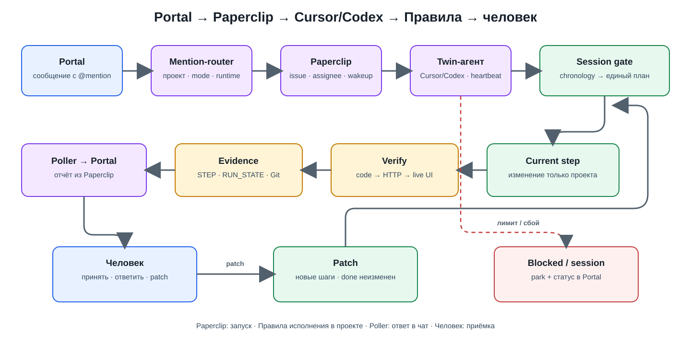

# Управляемая разработка с ИИ через корпоративный портал

Сотрудник ставит задачу в чате Bitrix24. Связка с Paperclip назначает Cursor или Codex, агент выполняет изменение на stage по плану, а отчёт возвращается в тот же чат для приёмки. Длинная задача сохраняет состояние между сессиями и исполнителями.

## Моя ответственность

Я отвечал за развитие процесса разработки с ИИ: организацию пилотных прогонов, формат постановки и исправлений, проверяемые критерии приёмки и правила продолжения работы. На практике это означало:

- связать продуктовую спецификацию с одним исполняемым планом;
- оформлять исправления отдельными пакетами с ID критериев, сохраняя принятую историю;
- разбирать незавершённые сценарии и превращать их в правила следующего прогона;
- участвовать в развитии stage-среды и связки Портала с исполнителями.

Paperclip — внешний продукт. Процесс, пилоты и локальную интеграцию развивала команда; опубликованные ниже фрагменты я подготовил отдельно для показа инженерных решений.

## Код: три места, которые стоит открыть

1. [Portal router — Python](code/portal_router.py): связывает сообщение с разрешённым проектом, выбирает Cursor/Codex и обнаруживает повторный запрос по fingerprint и TTL.
2. [Paperclip bridge — Python](code/paperclip_bridge.py): создаёт issue, сохраняет её связь с запросом до wakeup, принимает ответ человека и передаёт отчёт обратно через Portal-адаптер. При сбое wakeup можно повторить запуск существующей карточки.
3. [Проверка старта сессии — PHP](code/session_gate.php): записывает начало сессии и сверяет номера и состояния шагов между шапкой, таблицей прогресса и подробным планом; проверяет контракт handoff.

Это самостоятельные публичные реализации выбранных механизмов. Сетевой transport, авторизация, корпоративные hooks и запуск самих ИИ здесь не включены. Код позволяет разобрать решения без доступа к инфраструктуре работодателя.

## Как замыкается цикл

1. **Portal → router.** Человек упоминает бота в чате задачи. Router берёт проект из явного сопоставления, выбирает исполнителя и отделяет новый запрос от ответа по уже открытой работе.
2. **Router → Paperclip API.** Создаются issue и назначение агента. Wakeup запрашивает запуск; heartbeat Paperclip запускает адаптер Cursor или Codex. Это два отдельно настроенных исполнителя — twin-агента.
3. **Агент → правила исполнения.** Сначала запись в chronology — журнал сессии. Затем чтение единственного корневого плана. Пакет исправления (handoff) сначала включается в этот план, после чего исполняется текущий шаг.
4. **Реализация → проверки.** Для веб-функции недостаточно успешного HTTP: нужны действие в браузере и наблюдаемый результат. В STEP сохраняется отчёт шага, в RUN_STATE — точка продолжения, в Git — точка отката.
5. **Отчёт → poller → Portal.** Агент оставляет результат в Paperclip; poller переносит его в исходный чат. Человек принимает результат, отвечает на вопрос либо задаёт новое исправление.

**Разделение ответственности:** Paperclip управляет карточкой и запуском; Правила проекта задают порядок исполнения в проекте; человек определяет scope и принимает продуктовый результат. Технический статус done сам по себе не доказывает человеческую приёмку.

## Что видно на конкретном прогоне

[Разбор браузерного проекта и файлы примера](example-run/) основаны на изученных плане, хронологии, отчёте шага и состоянии stage-проекта.

Исполнитель добавил второй уровень, пока предыдущий шаг оставался на отдельном review. В отчёте зафиксированы проверки настоящим Chromium на desktop/mobile, полное прохождение и регрессия первого уровня. При этом успешный ответ удалённого валидатора относился к другому проекту — его не зачли и сверили локальный план отдельно.

Это показывает важный результат процесса: завершённая техническая работа, ожидаемая человеческая оценка и непригодное доказательство не смешиваются в один «всё зелёное».

## Решения, которые стоит обсудить на интервью

- **Один план.** Handoff — входные данные для изменения плана; исполнение вложенного файла как отдельного ТЗ запрещено.
- **Полный сценарий.** Кнопка, API и состояние принимаются вместе, если это входит в scope. [Как ошибка проверки меняет критерий готовности](FAILURE_STORY.md).
- **Повторы и сбои запуска.** Отдельно сохраняются создание issue и запрос запуска. JSON-хранилище примера рассчитано на один poller; межпроцессные гонки и неопределённый исход сетевого create требуют отдельного решения.
- **Лимит и новая сессия.** Состояние сохраняется на диске. Автоматическое восстановление после любого сбоя не обещается.
- **Review и patch.** Ответ человека продолжает связанную карточку; новый scope создаёт новую задачу. Принятый шаг сохраняется, исправление добавляет следующие шаги.
- **Статус в чате.** 🏁 — отчёт о результате, 👀 — нужен ответ, 🔐 — агент заявил блокер. Последний может оказаться ложным и требует проверки.

## Как посмотреть поведение кода

Из этой папки, Python 3.11+ и PHP 8.2+, без зависимостей и сетевых запросов:

~~~sh
python code/portal_router.py example-run/01-portal-message.json example-run/project-map.json
php code/session_gate.php example-run/06-implementation-plan.md
~~~

Первая команда только вычисляет маршрут; fingerprint запоминает вызывающий poller после создания issue. Вторая проверяет план. Bridge читается как API-адаптер с подставляемым transport. Gate проверяет контракт handoff, но не реализует его слияние и не заменяет файловые разрешения среды.

## Где этот подход оправдан

Для задач на несколько сессий, с передачей между исполнителями и приёмкой на нескольких слоях. Для небольшой правки достаточно issue и CI. Журналы и план дают восстановимость ценой дополнительной работы; измеренный процент экономии здесь не заявлен.
